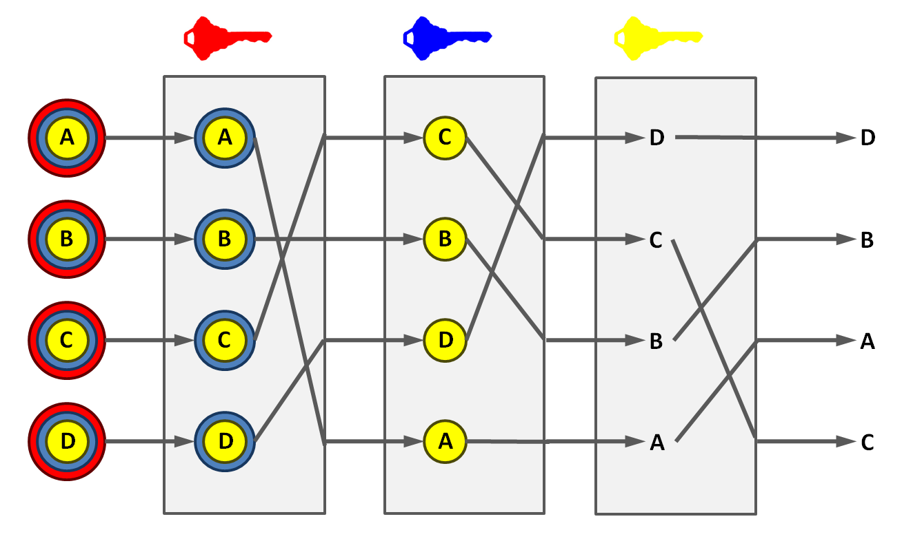

<h3 align="center">42 São Paulo - Born2BeRoot</h3>

<div align="center">


</div>

<p align="center"> Virtual Linux server setup and config.
  <br>
</p>

---

## 📜 Table of Contents

- [About](#about)
- [Checklist](#checklist)
- [Notes](#notes)
- [42 São Paulo](#ft_sp)
- [Resources](#resources)

## 🧐 About <a name = "about"></a>

In this project we learn the fundamentals of UNIX, virtualization,
system administration and shell scripting.
Among other things, we create a debian virtual machine with LVM partitions,
write a sysinfo script and setup a wordpress website.

## ✅ Checklist <a name = "checklist"></a>

- [x] Install Debian VM w/ correct partitions and encrypted LVM
  - [x] Primary boot partition
  - [x] Encrypted LVM Group
    - [x] /
    - [x] /swap
    - [x] /home
    - [x] /var
    - [x] /srv
    - [x] /tmp
    - [x] /var/log
  - [x] lpaulo-m42 hostname
  - [x] lpaulo-m user
- [x] Add lpaulo-m to `sudo` and `user42` groups
- [x] Practice changing hostname
- [x] Practice creating and deleting a sudoer user
- [x] Install and configure `ufw`
  - [x] Create allow rule for port 4242
- [x] Install and configure `ssh`
  - [x] On port 4242
  - [x] Can't connect as root
  - [x] Set a static IP
- [x] Install and configure `sudo`
  - [x] Limit authentication to 3 attempts
  - [x] Add custom message on failed attempt
  - [x] Log authentication attempts in `/var/log/sudo/`
  - [x] Restrict sudo to TTY mode only
  - [x] Restrict sudo paths to `/usr/local/sbin:/usr/local/bin:/usr/sbin:/usr/bin:/sbin:/bin:/snap/bin`
- [x] Implement a strong password policy
  - [x] Expire password every 30 days.
  - [x] Wait 2 days before password change
  - [x] Warning message 7 days before expiration
  - [x] Minimum password length of 10
  - [x] Must contain an uppercase letter
  - [x] Must contain a digit
  - [x] No more than 3 consecutive identical chars
  - [x] Must not include username
  - [x] New password must have at least 7 characters that are not part of the former password (except for root user)
  - [x] Root password must comply
  - [x] Change all users passwords after config
- [x] Write `monitoring.sh`
  - [x] Runs every 10 minutes from startup
  - [x] Runs every 10 minutes (`crontab`)
  - [x] Broadcast the following statistics to all users (`wall`)
    - [x] The OS architecture and kernel version.
    - [x] Number of physical processors.
    - [x] Number of virtual processors.
    - [x] Available RAM and percentage utilization rate
    - [x] Current available storage and percentage utilization rate.
    - [x] Percentage utilization rate your processors.
    - [x] Date and time of last reboot.
    - [x] Whether LVM is active or not.
    - [x] Number of active connections.
    - [x] Number of users using the server.
    - [x] The IPv4 and MAC (Media Access Control) address.
    - [x] Number of commands executed with the sudo
- [x] Bonus
  - [x] Setup a Wordpress website
    - [x] lighttpd
    - [x] MariaDB
    - [x] PHP
    - [x] Wordpress
  - [x] Set up an arbitrary service
    - [x] `bitcoind`
    - [x] Tor **Bridge** Relay
- [x] Backup virtual box from file explorer
- [x] Get virtual drive signature and add it to intra’s project repo

## 📝 Notes <a name = "notes"></a>

### Logical vs Primary Partition

The Master Boot Record Partition scheme only allows for 4 primary partitions.
To get around this we create an extended partition that contains logical partitions.
Windows can't boot from logical partitions, only primary one.

### LVM (Logical Volume Management)

A device mapper framework that provides logical volume management,
i.e. the creation and use of logical partitions.

### Encrypted volumes

It's highly recommended to encrypt your logical volumes,
especially the swap partition.
You don't need to go crazy with the password, this isn't the NSA.

<p align="center">
  
</p>

### systemd

A software suite that provides an array of system components.
Arch, CentOS, CoreOS, Debian, Fedora, Linux, Mageia,
Manjaro, openSUSE, Red, Solus, SUSE and Ubuntu come with it by default.

### Linux directory structure

- `/`: The root directory
- `/bin`: Binaries accessible to everyone
- `/dev`: Device files, like logical volumes
- `/etc`: Configuration files
- `/usr`: User binaries and program data
  - `/usr/bin`: contains basic user commands
  - `/usr/sbin`: contains additional commands for the administrator
  - `/usr/lib`: contains the system libraries
  - `/usr/share`: contains documentation or common to all libraries, like `/usr/share/man`
- `/home`: User personal data
- `/lib`: Shared libraries
- `/sbin`: System/Super/Sudo binaries (that can only be run by root or a sudo user)
- `/tmp`: Temporary files
- `/var`: Variable data files (like logs)
- `/boot`: Boot files, usually a primary partition is mounted here
- `/proc`: Process and kernel files like `/proc/cpuinfo`
- `/opt`: Optional/3rd-party software
- `/root`: The home directory of the root
- `/media`: Mount point for removable media
- `/mnt`: Mount directory for file systems by sysadmins
- `/srv`: Service data, like web apps

### Security-Enhanced Linux (SELinux) vs. AppArmor

They're both Linux kernel security modules.
They both provide Mandatory Access Control (MAC).

Fedora and CentOS use SELinux by default.
Debian and Ubuntu use AppArmor by default.

AppArmor is easier to use but a little less secure.
SELinux is harder to use but more secure.

Before any syscall the kernel check with AppArmor or SELinux
if the process is allowed to execute that command.
By configuring them we can restrict the actions
that subjects (processes) can perform
on objects (files, IO, memory, Network ports, etc.)

### Uncomplicated Firewall (UFW)

A program that manages the Netfilter firewall framework, native to the Linux kernel.
Ubuntu comes with UFW by default.

### aptitude vs. apt vs. apt-get

They're all package managers that use `dpkg` behind the scenes.
They all use the same repositories.

`aptitude` provides a terminal menu interface with `ncurses`
and it's easier to use.
Advanced Packaging Tool (`apt`) and `apt-get` are a collection of CLI tools.
`apt-get` was the first sub-project of `apt`.

Debian comes with `apt` by default.

### PAM (Pluggable Authentication Modules)

A suite of libraries that allows a Linux system administrator
to configure methods to authenticate users.
This is where we set the password policy.

### CPU Core (Physical) vs Thread (Virtual)

A CPU core is an independent processing unit that processes one command at a time.
It's a physical component inside a chip, mounted on a socket on the motherboard.
Modern chips, having multiple cores, need some way of sharing their processing
resources with many programs at the same time.

Threads solve this problem by distributing instructions to multiple cores.
They're virtual components that manage the CPU schedule.
They act like independent CPU
since programs interact with them as they would a core:
a thread receives a command,
sends it to an available core,
waits for it to execute and returns the value.

My computer runs on an
[Intel Core i7-7700HQ](https://www.intel.com/content/www/us/en/products/sku/97185/intel-core-i77700hq-processor-6m-cache-up-to-3-80-ghz/specifications.html).
It has 4 cores and 8 threads, so my system monitor list it as 8 virtual CPUs.

<p align="center">
  
</p>

### `monitoring.sh`

We have to write a monitoring script that broadcasts every 10 minutes
various system stats with `wall`:

```bash
Broadcast message from root@lpaulo-m42 (somewhere) (Tue Dec 21 00:30:01 2021):

  # Architecture: Linux lpaulo-m42 5.10.0-9-amd64 #1 SMP Debian 5.10.70-1 (2021-09-30) x86_64 GNU/Linux
  # Physical CPUs (cores): 2
  # Virtual CPUs (threads): 2
  # Memory Usage: 218/976MB (22.33%)
  # Disk Usage: 1.1/8.0GB (15%%)
  # CPU load: .14%
  # Last boot: 2021-12-20 09:49
  # LVM enabled: false
  # TCP Connections: 2 - ESTABLISHED
  # Logged-in Users: 2
  # IP address: 192.168.0.15
  # MAC address: 08:00:27:25:76:99
  # Sudo commands: 326
```

### FastCGI

Is a protocol that interfaces applications (like PHP)
to web servers (like lighttpd and apache);

### Bonus Service Ideas

- [searx Search Engine](https://github.com/searx/searx)
  - https://searx.github.io/searx/admin/installation.html
  - https://searx.github.io/searx/admin/installation-searx.html
  - https://searx.github.io/searx/admin/installation-docker.html
- [phpMyAdmin](https://docs.phpmyadmin.net/en/latest/setup.html)
- [traefik Proxy](https://github.com/traefik/traefik/)
  - https://doc.traefik.io/traefik/getting-started/install-traefik/
  - https://github.com/approov/debian-traefik-setup
- [Cockpit sysadmin webview](https://github.com/cockpit-project/cockpit)
  - https://www.techlear.com/blog/2021/10/14/how-to-install-cockpit-on-debian-11/
- [fail2ban security](https://github.com/fail2ban/fail2ban)
  - https://www.fail2ban.org/wiki/index.php/MANUAL_0_8#Installation
- [vsftpd](https://github.com/InfrastructureServices/vsftpd)
  - https://www.osradar.com/how-to-set-up-an-ftp-server-on-debian-10-buster/
  - https://linuxconfig.org/how-to-setup-vsftpd-on-debian
- [Docker](https://www.digitalocean.com/community/tutorials/how-to-install-and-use-docker-on-debian-10)
- [PostgreSQL DB](https://linuxize.com/post/how-to-install-postgresql-on-debian-10/)
- [Email](https://www.tecmint.com/setup-postfix-mail-server-in-ubuntu-debian/)
- [DNS](https://blog.eldernode.com/private-dns-server-in-debian-10/)
- [InterPlanetary File System](https://github.com/ipfs/go-ipfs)
  - https://docs.ipfs.io/how-to/command-line-quick-start/#prerequisites
- One of your web apps:
  - Rails
  - Go
  - Node.js
- A blockchain node:
  - [https://bitcoin.org/en/full-node](https://bitcoin.org/en/full-node)
- A mixnet node:
  - [TOR Network Relay](<https://en.wikipedia.org/wiki/Tor_(network)>)
    - [Relay guide](https://community.torproject.org/relay/)
    - [Relay guide (onion link)](http://xmrhfasfg5suueegrnc4gsgyi2tyclcy5oz7f5drnrodmdtob6t2ioyd.onion/relay/)
  - [I2P](https://en.wikipedia.org/wiki/I2P)
  - [ZeroNet](https://en.wikipedia.org/wiki/ZeroNet)
  - [Retroshare](https://en.wikipedia.org/wiki/Retroshare)
  - [Tribler](https://en.wikipedia.org/wiki/Tribler)
  - [Nym](https://github.com/nymtech/nym)

### Bitcoin Core and `bitcoind`

I really wanted to run a bitcoin node on my server.
I even managed to install and configure `bitcoind`,
but whenever I started the server it would error out
due to insufficient disk space.
I don't have a lot of storage space available,
so I left it as is.

I really wanted to finish the config process and have a working node,
but I learned a lot about bitcoin during the process.
I'm sure I'll be running a full node when I get some better hardware
(I'm obsessed with blockchain and crypto if you haven't noticed yet).

### Tor **Bridge** Relay

Tor is a
[mix network protocol](https://en.wikipedia.org/wiki/Mix_network)
that allows users to hide their IP by relaying requests through a chain of
three random proxies:

1. **The Guard**
2. **The Middle**
3. **The Exit**

<p align="center">
  
</p>

The request is encrypted three times with three different keys.
Each relay decrypts the request with its corresponding key
and forwards it to the next except for **The Exit**,
which forwards the request to its intended destination.
The end receiver of the request can only see **The Exit**'s IP,
hiding the identity of the sender.
It can also be used to access restricted or illegal content
in countries that censor online traffic.

People from all over the world who believe in our fundamental right
to privacy, anonymity and free speech run proxy relays
that maintain the Tor network.
The more relays the network has,
the greater the amount of paths a request could take
and the harder it is to identify the sender.
It also runs faster.

In my Debian server I installed and configured a **Bridge** Relay,
which is a special type of **Middle** that doesn't list its IP publicly.
Users first have to connect to to the Tor network
to discover and use **Bridge** relays.
It's by far the easiest relay type to setup
and it requires the least amount of network resources.

## 🛸 42 São Paulo <a name = "ft_sp"></a>

Part of the larger [42 Network](https://www.42.fr/42-network/),
[42 São Paulo](https://www.42sp.org.br/) is a software engineering school
that offers a healthy alternative to traditional education:

- It doesn't have any teachers and classes.
- Students learn by cooperating
  and correcting each other's work (peer-to-peer learning).
- Its focus is as much on social skills as it is on technical skills.
- It's completely free to anyone that passes its selection process -
  [**The Piscine**](https://42.fr/en/admissions/42-piscine/)

It's an amazing school, and I'm grateful for the opportunity.

## 📚 Resources <a name = "resources"></a>

### Debian

- [https://www.debian.org/releases/bullseye/installmanual](https://www.debian.org/releases/bullseye/installmanual)
- [https://www.howtoforge.com/tutorial/debian-minimal-server/](https://www.howtoforge.com/tutorial/debian-minimal-server/)
- [https://debian-handbook.info/download/en-US/stable/debian-handbook.pdf](https://debian-handbook.info/download/en-US/stable/debian-handbook.pdf)
- [https://debian-handbook.info/browse/stable/](https://debian-handbook.info/browse/stable/)

### CentOS

- [https://linuxhint.com/install_centos8_virtualbox/](https://linuxhint.com/install_centos8_virtualbox/)

### systemd

- [https://en.wikipedia.org/wiki/Systemd](https://en.wikipedia.org/wiki/Systemd)
- [https://www.slant.co/options/12956/alternatives/~systemd-alternatives](https://www.slant.co/options/12956/alternatives/~systemd-alternatives)

### Partitions

- [https://wikiless.org/wiki/Partition\_(computing)?lang=en](<https://wikiless.org/wiki/Partition_(computing)?lang=en>)
- [https://askubuntu.com/questions/495994/what-filesystem-should-boot-be](https://askubuntu.com/questions/495994/what-filesystem-should-boot-be)
- https://superuser.com/questions/337146/what-are-the-differences-between-primary-and-logical-partition
- https://en.wikipedia.org/wiki/Master_boot_record

### LVM

- https://linuxhandbook.com/lvm-guide/
- [https://wikiless.org/wiki/Logical*Volume_Manager*(Linux)](<https://wikiless.org/wiki/Logical_Volume_Manager_(Linux)?lang=en>)
- [https://wikiless.org/wiki/Logical_volume_management](https://wikiless.org/wiki/Logical_volume_management)

### Linux Dir Structure

- [https://www.geeksforgeeks.org/linux-directory-structure/](https://www.geeksforgeeks.org/linux-directory-structure/)
- [https://linuxhandbook.com/linux-directory-structure/](https://linuxhandbook.com/linux-directory-structure/)

### [Advanced Packaging Tool (apt)](https://thecustomizewindows.com/2014/03/what-is-advanced-packaging-tool-apt-aptitude/)

- [https://thecustomizewindows.com/2020/01/aptitude-vs-apt-get-vs-apt/](https://thecustomizewindows.com/2020/01/aptitude-vs-apt-get-vs-apt/)

### IP and Ports

- [https://linuxconfig.org/how-to-setup-a-static-ip-address-on-debian-linux](https://linuxconfig.org/how-to-setup-a-static-ip-address-on-debian-linux)

### Users and Groups

- [https://www.cyberciti.biz/faq/howto-change-rename-user-name-id/](https://www.cyberciti.biz/faq/howto-change-rename-user-name-id/)

### Hostname

- [https://phoenixnap.com/kb/debian-change-hostname](https://phoenixnap.com/kb/debian-change-hostname)

### **AppArmor**

- [https://en.wikipedia.org/wiki/AppArmor](https://en.wikipedia.org/wiki/AppArmor)
- [https://en.wikipedia.org/wiki/Linux_Security_Modules](https://en.wikipedia.org/wiki/Linux_Security_Modules)
- [https://www.omarine.org/blog/apparmor-vs-selinux/](https://www.omarine.org/blog/apparmor-vs-selinux/)
- [https://beginlinux.com/desktop_training/ubuntu/ubsecure_m/Secure_ub/aap_selinux](https://beginlinux.com/desktop_training/ubuntu/ubsecure_m/Secure_ub/aap_selinux)
- [https://en.wikipedia.org/wiki/Mandatory_access_control](https://en.wikipedia.org/wiki/Mandatory_access_control)

### Uncomplicated Firewall (UFW)

- [https://en.wikipedia.org/wiki/Uncomplicated_Firewall](https://en.wikipedia.org/wiki/Uncomplicated_Firewall)
- [https://www.linux.com/training-tutorials/introduction-uncomplicated-firewall-ufw/](https://www.linux.com/training-tutorials/introduction-uncomplicated-firewall-ufw/)
- [https://www.digitalocean.com/community/tutorials/how-to-set-up-a-firewall-with-ufw-on-debian-9](https://www.digitalocean.com/community/tutorials/how-to-set-up-a-firewall-with-ufw-on-debian-9)
- [https://en.wikipedia.org/wiki/Netfilter](https://en.wikipedia.org/wiki/Netfilter)

### SSH

- [https://linuxize.com/post/how-to-change-ssh-port-in-linux/](https://linuxize.com/post/how-to-change-ssh-port-in-linux/)

### Sudo

- [https://www.real-world-systems.com/docs/sudoers.5.html](https://www.real-world-systems.com/docs/sudoers.5.html)
- [https://phoenixnap.com/kb/create-a-sudo-user-on-debian](https://phoenixnap.com/kb/create-a-sudo-user-on-debian)
- [https://www.vivaolinux.com.br/dica/Bloquear-restringir-acesso-ao-su-somente-ao-grupo-wheel](https://www.vivaolinux.com.br/dica/Bloquear-restringir-acesso-ao-su-somente-ao-grupo-wheel)
- [https://serverfault.com/questions/649143/sudo-io-log-output-shows-garbled-text](https://serverfault.com/questions/649143/sudo-io-log-output-shows-garbled-text)
- [https://www.digitalocean.com/community/tutorials/how-to-edit-the-sudoers-file](https://www.digitalocean.com/community/tutorials/how-to-edit-the-sudoers-file)
- [https://www.tecmint.com/sudoers-configurations-for-setting-sudo-in-linux/](https://www.tecmint.com/sudoers-configurations-for-setting-sudo-in-linux/)
- [https://www.sudo.ws/docs/man/1.8.15/sudoers.man/](https://www.sudo.ws/docs/man/1.8.15/sudoers.man/)
- [https://stackoverflow.com/questions/67985925/why-would-i-want-to-require-a-tty-for-sudo-whats-the-security-benefit-of-requi](https://stackoverflow.com/questions/67985925/why-would-i-want-to-require-a-tty-for-sudo-whats-the-security-benefit-of-requi)

### Passwords

- [https://www.debian.org/doc/manuals/securing-debian-manual/ch04s11.en.html](https://www.debian.org/doc/manuals/securing-debian-manual/ch04s11.en.html)
- [https://en.wikipedia.org/wiki/Pluggable_authentication_module](https://en.wikipedia.org/wiki/Pluggable_authentication_module)
- [http://www.linux-pam.org/Linux-PAM-html/](http://www.linux-pam.org/Linux-PAM-html/)
  - https://github.com/linux-pam/linux-pam
- [https://docs.fedoraproject.org/en-US/quick-docs/reset-root-password/](https://docs.fedoraproject.org/en-US/quick-docs/reset-root-password/)
- [https://www.tecmint.com/reset-forgotten-root-password-in-debian/](https://www.tecmint.com/reset-forgotten-root-password-in-debian/)

### Password Policy

- [https://linux.die.net/man/8/pam_pwquality](https://linux.die.net/man/8/pam_pwquality)
- [https://linux.die.net/man/8/pam_cracklib](https://linux.die.net/man/8/pam_cracklib)
- [https://access.redhat.com/solutions/5027331](https://access.redhat.com/solutions/5027331)
- [https://computingforgeeks.com/enforce-strong-user-password-policy-ubuntu-debian/](https://computingforgeeks.com/enforce-strong-user-password-policy-ubuntu-debian/)
- [https://stackoverflow.com/questions/70328764/set-password-expiration-policy-for-all-users-on-debian-login-defs-doesnt-work](https://stackoverflow.com/questions/70328764/set-password-expiration-policy-for-all-users-on-debian-login-defs-doesnt-work)
- [https://www.poftut.com/linux-etc-login-defs-configuration-examples/](https://www.poftut.com/linux-etc-login-defs-configuration-examples/)

### Bash

- [https://linuxize.com/post/bash-shebang/](https://linuxize.com/post/bash-shebang/)
- [https://unix.stackexchange.com/questions/29878/can-i-access-nth-line-number-of-standard-output](https://unix.stackexchange.com/questions/29878/can-i-access-nth-line-number-of-standard-output)
- [https://riptutorial.com/bash/topic/8762/the-cut-command](https://riptutorial.com/bash/topic/8762/the-cut-command)
- [https://stackoverflow.com/questions/11454343/pipe-output-to-bash-function](https://stackoverflow.com/questions/11454343/pipe-output-to-bash-function)
- [https://www.baeldung.com/linux/silencing-bash-output](https://www.baeldung.com/linux/silencing-bash-output)
- [https://unix.stackexchange.com/questions/338000/bash-assign-output-of-pipe-to-a-variable](https://unix.stackexchange.com/questions/338000/bash-assign-output-of-pipe-to-a-variable)
- [https://askubuntu.com/questions/1042659/how-to-check-if-a-value-is-greater-than-or-equal-to-another](https://askubuntu.com/questions/1042659/how-to-check-if-a-value-is-greater-than-or-equal-to-another)
- [https://linuxhandbook.com/if-else-bash/](https://linuxhandbook.com/if-else-bash/)
- [https://stackoverflow.com/questions/13182070/best-way-to-divide-in-bash-using-pipes](https://stackoverflow.com/questions/13182070/best-way-to-divide-in-bash-using-pipes)
- [https://stackoverflow.com/questions/816820/use-space-as-a-delimiter-with-cut-command](https://stackoverflow.com/questions/816820/use-space-as-a-delimiter-with-cut-command)
- [https://stackoverflow.com/questions/14093452/grep-only-the-first-match-and-stop](https://stackoverflow.com/questions/14093452/grep-only-the-first-match-and-stop)

### `sed`

- [https://www.cyberciti.biz/faq/sed-remove-all-except-digits-numbers/](https://www.cyberciti.biz/faq/sed-remove-all-except-digits-numbers/)
- [https://linuxhint.com/bash_sed_examples/](https://linuxhint.com/bash_sed_examples/)

### Bash Math

- [https://www.gnu.org/software/bc/manual/html_mono/bc.html](https://www.gnu.org/software/bc/manual/html_mono/bc.html)
- [https://unix.stackexchange.com/questions/40786/how-to-do-integer-float-calculations-in-bash-or-other-languages-frameworks](https://unix.stackexchange.com/questions/40786/how-to-do-integer-float-calculations-in-bash-or-other-languages-frameworks)
- [https://stackoverflow.com/questions/55277725/bash-calculate-percentage](https://stackoverflow.com/questions/55277725/bash-calculate-percentage)
- [https://ryanstutorials.net/bash-scripting-tutorial/bash-arithmetic.php](https://ryanstutorials.net/bash-scripting-tutorial/bash-arithmetic.php)

### Bash Functions

- [https://ryanstutorials.net/bash-scripting-tutorial/bash-functions.php](https://ryanstutorials.net/bash-scripting-tutorial/bash-functions.php)
- [https://linuxhint.com/return-string-bash-functions/](https://linuxhint.com/return-string-bash-functions/)
- [https://stackoverflow.com/questions/3236871/how-to-return-a-string-value-from-a-bash-function](https://stackoverflow.com/questions/3236871/how-to-return-a-string-value-from-a-bash-function)
- [https://stackoverflow.com/questions/17336915/return-value-in-a-bash-function](https://stackoverflow.com/questions/17336915/return-value-in-a-bash-function)

### Bash Strings

- [https://unix.stackexchange.com/questions/20035/how-to-add-newlines-into-variables-in-bash-script](https://unix.stackexchange.com/questions/20035/how-to-add-newlines-into-variables-in-bash-script)
- [https://unix.stackexchange.com/questions/334240/how-to-add-a-line-break-inside-a-bash-string](https://unix.stackexchange.com/questions/334240/how-to-add-a-line-break-inside-a-bash-string)
- [https://linuxhandbook.com/bash-strings/](https://linuxhandbook.com/bash-strings/)
- [https://www.cyberciti.biz/faq/bash-remove-whitespace-from-string/](https://www.cyberciti.biz/faq/bash-remove-whitespace-from-string/)
- [https://unixutils.com/string-manipulation-with-bash/](https://unixutils.com/string-manipulation-with-bash/)
- [https://linuxhint.com/remove_characters_string_bash/](https://linuxhint.com/remove_characters_string_bash/)

### Bash Arrays

- [https://www.shell-tips.com/bash/arrays/](https://www.shell-tips.com/bash/arrays/)
- [https://www.educba.com/bash-split-string/](https://www.educba.com/bash-split-string/)
- [https://stackoverflow.com/questions/36977855/get-last-element-in-bash-array](https://stackoverflow.com/questions/36977855/get-last-element-in-bash-array)

### nano

- [https://linuxhint.com/select_delete_all_text_nano/](https://linuxhint.com/select_delete_all_text_nano/)

### `monitoring.sh`

- [https://www.geeksforgeeks.org/wall-command-in-linux-with-examples/](https://www.geeksforgeeks.org/wall-command-in-linux-with-examples/)
- [https://www.tutorialspoint.com/unix_commands/uname.htm](https://www.tutorialspoint.com/unix_commands/uname.htm)

### CPUs

- [https://www.educba.com/cores-vs-threads/](https://www.educba.com/cores-vs-threads/)
- [https://linuxhandbook.com/check-cpu-info-linux/](https://linuxhandbook.com/check-cpu-info-linux/)
- [https://www.tecmint.com/check-linux-cpu-information/](https://www.tecmint.com/check-linux-cpu-information/)
- [https://www.intel.com/content/www/us/en/products/sku/97185/intel-core-i77700hq-processor-6m-cache-up-to-3-80-ghz/specifications.html](https://www.intel.com/content/www/us/en/products/sku/97185/intel-core-i77700hq-processor-6m-cache-up-to-3-80-ghz/specifications.html)
- [https://stackoverflow.com/questions/6481005/how-to-obtain-the-number-of-cpus-cores-in-linux-from-the-command-line](https://stackoverflow.com/questions/6481005/how-to-obtain-the-number-of-cpus-cores-in-linux-from-the-command-line)
- [https://webhostinggeeks.com/howto/how-to-display-the-number-of-processors-vcpu-on-linux-vps/](https://webhostinggeeks.com/howto/how-to-display-the-number-of-processors-vcpu-on-linux-vps/)
- [https://stackoverflow.com/questions/9229333/how-to-get-overall-cpu-usage-e-g-57-on-linux](https://stackoverflow.com/questions/9229333/how-to-get-overall-cpu-usage-e-g-57-on-linux)
- [https://en.wikipedia.org/wiki/Hyper-threading](https://en.wikipedia.org/wiki/Hyper-threading)
- [https://www.howtogeek.com/194756/cpu-basics-multiple-cpus-cores-and-hyper-threading-explained/](https://www.howtogeek.com/194756/cpu-basics-multiple-cpus-cores-and-hyper-threading-explained/)

### CPU Load

- [https://phoenixnap.com/kb/check-cpu-usage-load-linux](https://phoenixnap.com/kb/check-cpu-usage-load-linux)
- [https://stackoverflow.com/questions/9229333/how-to-get-overall-cpu-usage-e-g-57-on-linux](https://stackoverflow.com/questions/9229333/how-to-get-overall-cpu-usage-e-g-57-on-linux)
- [https://unix.stackexchange.com/questions/152988/how-to-get-cpu-usage-for-every-core-with-a-bash-script-using-standard-nix-tools](https://unix.stackexchange.com/questions/152988/how-to-get-cpu-usage-for-every-core-with-a-bash-script-using-standard-nix-tools)

### Memory

- [https://stackoverflow.com/questions/2441046/how-to-get-the-total-physical-memory-in-bash-to-assign-it-to-a-variable](https://stackoverflow.com/questions/2441046/how-to-get-the-total-physical-memory-in-bash-to-assign-it-to-a-variable)
- [https://phoenixnap.com/kb/linux-commands-check-memory-usage](https://phoenixnap.com/kb/linux-commands-check-memory-usage)

### Disk Storage

- [https://www.howtogeek.com/409611/how-to-view-free-disk-space-and-disk-usage-from-the-linux-terminal/](https://www.howtogeek.com/409611/how-to-view-free-disk-space-and-disk-usage-from-the-linux-terminal/)

### Boot History

- [https://www.geeksforgeeks.org/linux-uptime-command-with-examples/](https://www.geeksforgeeks.org/linux-uptime-command-with-examples/)
- [https://www.cyberciti.biz/tips/linux-last-reboot-time-and-date-find-out.html](https://www.cyberciti.biz/tips/linux-last-reboot-time-and-date-find-out.html)

### LVM

- [https://docstore.mik.ua/manuals/hp-ux/en/5992-4589/ch03s02.html](https://docstore.mik.ua/manuals/hp-ux/en/5992-4589/ch03s02.html)
- [https://askubuntu.com/questions/202613/how-do-i-check-whether-i-am-using-lvm](https://askubuntu.com/questions/202613/how-do-i-check-whether-i-am-using-lvm)

### `ss` and TCP Connections

- [https://www.networkworld.com/article/3327557/using-the-linux-ss-command-to-examine-network-and-socket-connections.html](https://www.networkworld.com/article/3327557/using-the-linux-ss-command-to-examine-network-and-socket-connections.html)
- [https://www.cyberciti.biz/faq/check-network-connection-linux/](https://www.cyberciti.biz/faq/check-network-connection-linux/)
- [https://unix.stackexchange.com/questions/67150/getting-current-tcp-connection-count-on-a-system](https://unix.stackexchange.com/questions/67150/getting-current-tcp-connection-count-on-a-system)
- [https://computingforgeeks.com/how-to-check-tcp-connections-states-in-linux-with-netstat/](https://computingforgeeks.com/how-to-check-tcp-connections-states-in-linux-with-netstat/)

### Logged-in Users

- [https://stackoverflow.com/questions/28208069/linux-bash-script-to-determine-number-of-users-logged-in](https://stackoverflow.com/questions/28208069/linux-bash-script-to-determine-number-of-users-logged-in)

### IP and MAC

- [https://www.cyberciti.biz/faq/bash-shell-command-to-find-get-ip-address/](https://www.cyberciti.biz/faq/bash-shell-command-to-find-get-ip-address/)
- [https://stackoverflow.com/questions/23828413/get-mac-address-using-shell-script](https://stackoverflow.com/questions/23828413/get-mac-address-using-shell-script)

### `wall`

- [https://www.geeksforgeeks.org/wall-command-in-linux-with-examples/](https://www.geeksforgeeks.org/wall-command-in-linux-with-examples/)

### Cron

- [https://crontab.guru/every-10-minutes](https://crontab.guru/every-10-minutes)
- [https://phoenixnap.com/kb/crontab-reboot](https://phoenixnap.com/kb/crontab-reboot)
- [https://serverfault.com/questions/37244/crontab-ifconfig-outputting-nothing](https://serverfault.com/questions/37244/crontab-ifconfig-outputting-nothing)
- [https://vitux.com/how-to-setup-a-cron-job-in-debian-10/](https://vitux.com/how-to-setup-a-cron-job-in-debian-10/)
- [https://askubuntu.com/questions/1051066/cronjob-every-20-minutes-starting-direct-after-reboot](https://askubuntu.com/questions/1051066/cronjob-every-20-minutes-starting-direct-after-reboot)
- [https://askubuntu.com/questions/816285/what-is-the-difference-between-systemctl-mask-and-systemctl-disable](https://askubuntu.com/questions/816285/what-is-the-difference-between-systemctl-mask-and-systemctl-disable)

### Run every 10 minutes from startup

- [https://raspberrypi.stackexchange.com/questions/15475/run-bash-script-on-startup](https://raspberrypi.stackexchange.com/questions/15475/run-bash-script-on-startup)
- [https://www.geeksforgeeks.org/linux-uptime-command-with-examples/](https://www.geeksforgeeks.org/linux-uptime-command-with-examples/)
- [https://linuxhandbook.com/bash-sleep/](https://linuxhandbook.com/bash-sleep/)

### Lighttpd

- [https://www.lighttpd.net/](https://www.lighttpd.net/)
- [https://www.tecmint.com/install-lighttpd-in-ubuntu/](https://www.tecmint.com/install-lighttpd-in-ubuntu/)
- [https://www.rosehosting.com/blog/how-to-install-lighttpd-on-debian-9/](https://www.rosehosting.com/blog/how-to-install-lighttpd-on-debian-9/)
- [https://vijaynayani.wordpress.com/2010/10/09/how-to-installing-lighttpd-with-php5-and-mysql-support-on-centos/](https://vijaynayani.wordpress.com/2010/10/09/how-to-installing-lighttpd-with-php5-and-mysql-support-on-centos/)
- [https://www.howtoforge.com/how-to-install-lighttpd-with-php-and-mariadb-on-debian-10/](https://www.howtoforge.com/how-to-install-lighttpd-with-php-and-mariadb-on-debian-10/)

### WordPress

- [https://wordpress.org/](https://wordpress.org/)
- [https://www.how2shout.com/linux/install-wordpress-on-lighttpd-web-server-ubuntu/](https://www.how2shout.com/linux/install-wordpress-on-lighttpd-web-server-ubuntu/)
- [https://websiteforstudents.com/install-wordpress-on-ubuntu-16-04-lts-with-lighttpd-mariadb-and-php-7-1-support/](https://websiteforstudents.com/install-wordpress-on-ubuntu-16-04-lts-with-lighttpd-mariadb-and-php-7-1-support/)
- [https://www.atlantic.net/dedicated-server-hosting/how-to-install-wordpress-with-lighttpd-web-server-on-ubuntu-20-04/](https://www.atlantic.net/dedicated-server-hosting/how-to-install-wordpress-with-lighttpd-web-server-on-ubuntu-20-04/)

### MariaDB

- [https://mariadb.org/](https://mariadb.org/)

### PHP

- [https://php.watch/articles/php-8.0-installation-update-guide-debian-ubuntu](https://php.watch/articles/php-8.0-installation-update-guide-debian-ubuntu)
- [https://www.linuxtechi.com/install-php-8-on-debian-10/](https://www.linuxtechi.com/install-php-8-on-debian-10/)
- https://en.wikipedia.org/wiki/FastCGI

### Bitcoin Core (GUI + daemon)

- https://github.com/bitcoin/bitcoin
- [https://bitcoincore.org/](https://bitcoincore.org/)
- [https://bitcoincore.org/en/download/](https://bitcoincore.org/en/download/)
- [https://github.com/bitcoin/bitcoin/tree/master/contrib/builder-keys](https://github.com/bitcoin/bitcoin/tree/master/contrib/builder-keys)
- [https://bitcoin.org/en/full-node](https://bitcoin.org/en/full-node)
- [https://en.bitcoin.it/wiki/Full_node](https://en.bitcoin.it/wiki/Full_node)
- [https://www.youtube.com/watch?v=xc_TxlByxeY](https://www.youtube.com/watch?v=xc_TxlByxeY)
- [https://en.bitcoin.it/wiki/Bitcoin_Core](https://en.bitcoin.it/wiki/Bitcoin_Core)

### `bitcoind`

- [https://en.bitcoin.it/wiki/Bitcoind](https://en.bitcoin.it/wiki/Bitcoind)
- [https://developer.bitcoin.org/reference/rpc/](https://developer.bitcoin.org/reference/rpc/)
- [https://bitnodes.io/#join-the-network](https://bitnodes.io/#join-the-network)
- [https://developer.bitcoin.org/reference/rpc/](https://developer.bitcoin.org/reference/rpc/)
- [https://vhernando.github.io/run-bitcoin-node-debian-how-to](https://vhernando.github.io/run-bitcoin-node-debian-how-to)
- [https://support.bitexchange.systems/support/articles/installing-bitcoin-onto-your-server](https://support.bitexchange.systems/support/articles/installing-bitcoin-onto-your-server)

### Bitcoin Community

- [https://bitcoin.org/en/community](https://bitcoin.org/en/community)
- [https://bitcointalk.org/](https://bitcointalk.org/)
- [https://bitcoin.stackexchange.com/](https://bitcoin.stackexchange.com/)
- [https://www.reddit.com/r/Bitcoin/](https://www.reddit.com/r/Bitcoin/)

### Tor **Bridge** Relay

- [http://xmrhfasfg5suueegrnc4gsgyi2tyclcy5oz7f5drnrodmdtob6t2ioyd.onion/relay/index.html](http://xmrhfasfg5suueegrnc4gsgyi2tyclcy5oz7f5drnrodmdtob6t2ioyd.onion/relay/index.html)
- [http://xmrhfasfg5suueegrnc4gsgyi2tyclcy5oz7f5drnrodmdtob6t2ioyd.onion/relay/types-of-relays/](http://xmrhfasfg5suueegrnc4gsgyi2tyclcy5oz7f5drnrodmdtob6t2ioyd.onion/relay/types-of-relays/)
- [http://xmrhfasfg5suueegrnc4gsgyi2tyclcy5oz7f5drnrodmdtob6t2ioyd.onion/relay/setup/](http://xmrhfasfg5suueegrnc4gsgyi2tyclcy5oz7f5drnrodmdtob6t2ioyd.onion/relay/setup/)
- [http://xmrhfasfg5suueegrnc4gsgyi2tyclcy5oz7f5drnrodmdtob6t2ioyd.onion/relay/setup/bridge/debian-ubuntu/](http://xmrhfasfg5suueegrnc4gsgyi2tyclcy5oz7f5drnrodmdtob6t2ioyd.onion/relay/setup/bridge/debian-ubuntu/)
- [http://xmrhfasfg5suueegrnc4gsgyi2tyclcy5oz7f5drnrodmdtob6t2ioyd.onion/relay/setup/post-install/](http://xmrhfasfg5suueegrnc4gsgyi2tyclcy5oz7f5drnrodmdtob6t2ioyd.onion/relay/setup/post-install/)
- [https://nyx.torproject.org/](https://nyx.torproject.org/)
